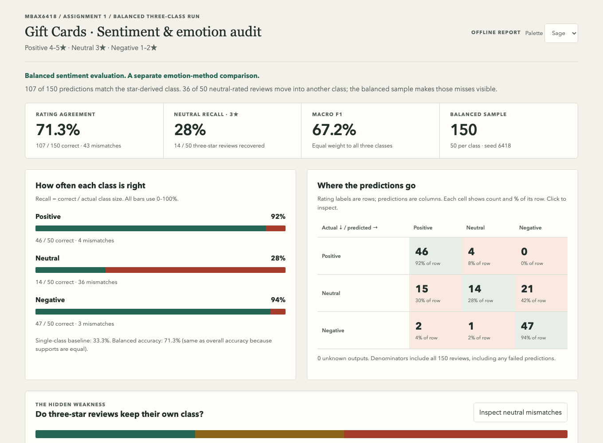
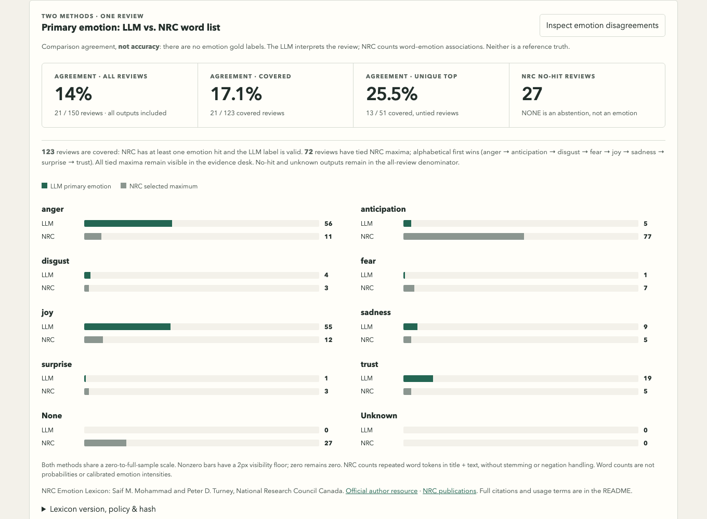

# Gift-card reviews: sentiment and emotion audit

## Data and method

Data: **Amazon Reviews ’23**, McAuley Lab, **Gift Cards** category, from the dataset page and its linked review download.[1] The supplied file contains **152,410 reviews**, verified by scanning it. The selected manifest is [balanced_sample.json](balanced_sample.json).

The final run samples **50 reviews per class (150 total)** from the entire file without replacement, using fixed seed **6418**. Labels are **4–5 stars = POSITIVE, 3 = NEUTRAL, 1–2 = NEGATIVE**. Only title and text go to `cyankiwi/Qwen3.6-35B-A3B-AWQ-4bit`, served through the course’s OpenAI-compatible endpoint; this is not an OpenAI model. [The prompt](prompt.txt) requests sentiment and one primary emotion together. The model does not see the rating.

## Why the lopsided run looked so good

The original binary run matched **98/100 (98.0%)**, but its labels were **93 positive and 7 negative**. Always predicting positive already scored **93.0%**. Three-star reviews were folded into negative, so neutral-class failure was invisible. See [the saved legacy summary](evidence/legacy_binary_summary.json).

The final balanced run scores **107/150 (71.3%)**, versus a **33.3%** single-class baseline. Macro F1 is **67.2%**; unknown outputs: **0**. Balanced accuracy equals overall accuracy because class sizes are equal. These results describe the balanced test, not the source file’s natural class prevalence. This is not a controlled before/after comparison: sample, class definitions, prompt, and parsing changed. The final joint prompt also differs from the earlier sentiment-only balanced run; all figures here use the final joint output.

## Where the mistakes go

Rows are actual rating labels; columns are model predictions. Source: [results_final.json](results_final.json), `metrics.matrix`.

| Actual | Positive | Neutral | Negative | Recall |
|---|---:|---:|---:|---:|
| Positive | 46 | 4 | 0 | 92.0% |
| Neutral | 15 | 14 | 21 | 28.0% |
| Negative | 2 | 1 | 47 | 94.0% |

The main direction is **neutral → negative (21)**, followed by **neutral → positive (15)**. Only **14/50** three-star reviews remain neutral; the reverse negative → neutral error occurs **1** time. Neutral-rated reviews account for **36 of 43 mismatches**. Balancing exposes a weak middle class that strong performance at the extremes had hidden. A mismatch is against a rating proxy, not proof that the model misread the text: a three-star review can still contain clearly favorable or critical language.

## LLM versus word-list emotions

The independent word-list method uses the **NRC Emotion Lexicon (EmoLex)** by **Saif M. Mohammad and Peter D. Turney, National Research Council Canada**.[2][3][4]

The associated papers are *Crowdsourcing a Word-Emotion Association Lexicon* (2013) and *Emotions Evoked by Common Words and Phrases: Using Mechanical Turk to Create an Emotion Lexicon* (2010).[3][4]

The word-list script lowercases and tokenizes title plus text, counts repeated words, sums the eight emotion associations, and takes the largest score. Ties select the first alphabetical emotion while retaining all tied candidates; no matches produce `NONE`. It does not handle negation, inflections, context, or word sense. The LLM is instead asked to choose the closest contextual emotion from those eight, even when emotional evidence is weak.

The methods agree on **21/150 (14.0%)**. NRC has **27 no-hit reviews** and **72 tied maxima**. Among covered reviews agreement is **21/123 (17.1%)**; among unique-maximum reviews it is **13/51 (25.5%)**. These are agreement rates, **not emotion accuracy**: there are no human emotion labels.

The LLM most often assigns **anger (56)** and **joy (55)**; NRC most often assigns **anticipation (77)**. The tie rule contributes to that skew, not just the review content. In source row **4444**, “Good gift,” the LLM chooses joy, while NRC ties anticipation, joy, and surprise and selects anticipation. In row **7443**, “so cute,” the LLM chooses joy but the exact-match lexicon has no emotion-bearing tokens. Those examples illustrate tie-breaking and vocabulary coverage—not evidence that one method is universally better. Full text, both labels, and all NRC scores are inspectable in the dashboard.

## Bugs, process issues, and checks

- The initial macOS `zcat` command failed; Python’s `gzip` reader replaced it. An assumed `review_id` field was absent; stable source row numbers now identify reviews.
- The early confusion matrix mixed short and full label names and crashed after inference. Existing predictions were rescored rather than requested again.
- The original parser could extract a label from unfinished reasoning, and the original CSV writer used JSON escaping instead of CSV quoting. The final runner accepts only schema-valid, completed final JSON; raw final content is retained verbatim. Structured JSONL is now the canonical output.
- An earlier narrative over-attributed a mistake to its title. Reading the full body revealed a real complaint; the report now separates observed outcomes from possible explanations.
- A tool timeout interrupted the joint run. Incrementally saved records allowed resumption by source ID without repeating completed reviews.
- A clean-checkout test caught the NRC server rejecting Python’s default user agent. The downloader now uses a tested accepted request header; a fresh checkout downloads the original resources and reproduces the report without new model calls.
- Browser checks compare DOM figures with saved output, test filters and live counts, and measure **nonzero bar widths** at desktop and mobile sizes. Small bars are checked geometrically, not just by eye. No collapsed bars were observed in the final verification. Screenshots show the tested interface.

## Working files and reproduction

| Deliverable | File |
|---|---|
| Exact final prompt | [prompt.txt](prompt.txt) |
| Review runner + scoring helpers | [run_reviews.py](run_reviews.py), [classify.py](classify.py) |
| Independent NRC scorer | [add_emotions.py](add_emotions.py) |
| Dashboard generator + template | [build_dashboard.py](build_dashboard.py), [dashboard_template.html](dashboard_template.html) |
| Balanced raw model output | [final_raw.jsonl](final_raw.jsonl) — verbatim final answers, status and request metadata; reasoning excluded |
| Scored sentiment + emotion output | [results_final.json](results_final.json) |
| Final offline dashboard | [results_dashboard.html](results_dashboard.html) — download and open locally |
| Reproduction and browser checks | [SETUP.md](SETUP.md), [test_dashboard_three.py](test_dashboard_three.py) |

## Sources

[1] https://amazon-reviews-2023.github.io
[2] https://saifmohammad.com/WebPages/NRC-Emotion-Lexicon.htm
[3] https://saifmohammad.com/WebDocs/Lexicons/NRC-Emotion-Lexicon.zip
[4] https://aclanthology.org/W10-0204
